## Root CA and Intermediate CAs

### Information
To be able to use this script, you need to ensure:
- $DOCLI variable exists and it is populated correctly;
- Fill `envs` file with necessary info;
- Fill `openssl_root_ca.cnf` and `openssl-intermediate-ca.cnf` with nedded info;
- Place all necessary certificate requests into cert-reqs folder with .sh extension. (check template)
- When all it is set, just run `./run` to generate all need files.
- You can run `./run` as many times as you want to generate new certificates, or to update certificate chains.

PS: Terraform get the files from `$DOCLI/CA/intermediateCA/certs-servers/host.short_region.environment.app.cert.pem` (ex: `vpn.use1.ent.devops.click.cert.pem`)

`certs`: This directory contains the certificates generated and signed by the CA. For the root CA, this includes the root CA certificate itself. For the intermediate CA, this includes the intermediate CA certificate and any server or client certificates signed by the intermediate CA.

`crl`: The Certificate Revocation List (CRL) directory contains the CRLs generated by the CA. A CRL is a list of certificates that have been revoked by the CA before their expiration date.
newcerts: This directory stores a copy of each certificate signed by the CA, with the certificate's serial number as the file name. It helps maintain a backup of all issued certificates.

`private`: This directory contains the private keys for the CA, including the root CA and intermediate CA private keys. These keys are used to sign certificates and CRLs. The private keys should be kept secure and not shared.

### Variables Precedence

It uses both of the variables bellow, but this is the precedence order:

`$DOCLI/.docli_envs` -> overrides -> `$DOCLI_PROJECT_ROOT/.docli_envs`


### Diagram
#### CA and Services Relationship Diagram
This diagram shows the relationship between the ROOT CA and various intermediate CAs and their respective services.

```mermaid
graph TD

  subgraph "ROOT CA"
    ROOT_CA[ROOT CA]
  end

  subgraph "ENT Environment"
    ENT_CA[INTERMEDIATE CA ENT]
    ENT_SERVICES[ENT Services]
    ENT_Consul[Consul]
    ENT_Nomad[Nomad]
    ENT_EKS[EKS]
    ENT_devops_click[ent.devops-click]
  end

  subgraph "PRD Environment"
    PRD_CA[INTERMEDIATE CA PRD]
    PRD_SERVICES[PRD Services]
    PRD_Consul[Consul]
    PRD_Nomad[Nomad]
    PRD_devops_click[qas.devops-click]
  end

  subgraph "STG Environment"
    STG_CA[INTERMEDIATE CA STG]
    STG_SERVICES[STG Services]
    STG_Consul[Consul]
    STG_Nomad[Nomad]
    STG_devops_click[stg.devops-click]
  end

  subgraph "QAS Environment"
    QAS_CA[INTERMEDIATE CA QAS]
    QAS_SERVICES[QAS Services]
    QAS_Consul[Consul]
    QAS_Nomad[Nomad]
    QAS_devops_click[qas.devops-click]
  end

  subgraph "DEV Environment"
    DEV_CA[INTERMEDIATE CA DEV]
    DEV_SERVICES[DEV Services]
    DEV_Consul[Consul]
    DEV_Nomad[Nomad]
    DEV_devops_click[dev.devops-click]
  end

  subgraph "VAL Environment"
    VAL_CA[INTERMEDIATE CA VAL]
    VAL_SERVICES[VAL Services]
    VAL_Consul[Consul]
    VAL_Nomad[Nomad]
    VAL_devops_click[val.devops-click]
  end

  ROOT_CA -->|Issues| ENT_CA
  ROOT_CA -->|Issues| PRD_CA
  ROOT_CA -->|Issues| STG_CA
  ROOT_CA -->|Issues| QAS_CA
  ROOT_CA -->|Issues| DEV_CA
  ROOT_CA -->|Issues| VAL_CA

  ROOT_CA --> ENT_CA
  ROOT_CA --> PRD_CA
  ROOT_CA --> STG_CA
  ROOT_CA --> QAS_CA
  ROOT_CA --> DEV_CA
  ROOT_CA --> VAL_CA

  ENT_CA --> ENT_SERVICES
  ENT_CA --> ENT_Consul
  ENT_CA --> ENT_Nomad
  ENT_CA --> ENT_EKS
  ENT_CA --> ENT_devops_click

  PRD_CA --> PRD_SERVICES
  PRD_CA --> PRD_Consul
  PRD_CA --> PRD_Nomad
  PRD_CA --> PRD_devops_click

  STG_CA --> STG_SERVICES
  STG_CA --> STG_Consul
  STG_CA --> STG_Nomad
  STG_CA --> STG_devops_click

  QAS_CA --> QAS_SERVICES
  QAS_CA --> QAS_Consul
  QAS_CA --> QAS_Nomad
  QAS_CA --> QAS_devops_click

  DEV_CA --> DEV_SERVICES
  DEV_CA --> DEV_Consul
  DEV_CA --> DEV_Nomad
  DEV_CA --> DEV_devops_click

  VAL_CA --> VAL_SERVICES
  VAL_CA --> VAL_Consul
  VAL_CA --> VAL_Nomad
  VAL_CA --> VAL_devops_click
```

```mermaid
graph TD
  ROOT_CA[ROOT CA]

  ENT_CA[INTERMEDIATE CA ENT]
  PRD_CA[INTERMEDIATE CA PRD]
  STG_CA[INTERMEDIATE CA STG]
  QAS_CA[INTERMEDIATE CA QAS]
  DEV_CA[INTERMEDIATE CA DEV]
  VAL_CA[INTERMEDIATE CA VAL]
  SEC_CA[INTERMEDIATE CA SEC]
  FIN_CA[INTERMEDIATE CA FIN]

  ENT_SERVICES[ENT Services]
  PRD_SERVICES[PRD Services]
  STG_SERVICES[STG Services]
  QAS_SERVICES[QAS Services]
  DEV_SERVICES[DEV Services]
  VAL_SERVICES[VAL Services]
  SEC_SERVICES[SEC Services]
  FIN_SERVICES[FIN Services]

  ENT_Consul[Consul]
  ENT_Nomad[Nomad]
  ENT_EKS[EKS]
  ENT_devops_click[ent.devops-click]

  PRD_Consul[Consul]
  PRD_Nomad[Nomad]
  PRD_devops_click[qas.devops-click]

  STG_Consul[Consul]
  STG_Nomad[Nomad]
  STG_devops_click[stg.devops-click]

  QAS_Consul[Consul]
  QAS_Nomad[Nomad]
  QAS_devops_click[qas.devops-click]

  DEV_Consul[Consul]
  DEV_Nomad[Nomad]
  DEV_devops_click[dev.devops-click]

  VAL_Consul[Consul]
  VAL_Nomad[Nomad]
  VAL_devops_click[val.devops-click]

  ROOT_CA -->|Issues| ENT_CA
  ROOT_CA -->|Issues| PRD_CA
  ROOT_CA -->|Issues| STG_CA
  ROOT_CA -->|Issues| QAS_CA
  ROOT_CA -->|Issues| DEV_CA
  ROOT_CA -->|Issues| VAL_CA
  ROOT_CA -->|Issues| SEC_CA
  ROOT_CA -->|Issues| FIN_CA

  ENT_CA --> ENT_SERVICES
  ENT_CA --> ENT_Consul
  ENT_CA --> ENT_Nomad
  ENT_CA --> ENT_EKS
  ENT_CA --> ENT_devops_click

  PRD_CA --> PRD_SERVICES
  PRD_CA --> PRD_Consul
  PRD_CA --> PRD_Nomad
  PRD_CA --> PRD_devops_click

  STG_CA --> STG_SERVICES
  STG_CA --> STG_Consul
  STG_CA --> STG_Nomad
  STG_CA --> STG_devops_click

  QAS_CA --> QAS_SERVICES
  QAS_CA --> QAS_Consul
  QAS_CA --> QAS_Nomad
  QAS_CA --> QAS_devops_click

  DEV_CA --> DEV_SERVICES
  DEV_CA --> DEV_Consul
  DEV_CA --> DEV_Nomad
  DEV_CA --> DEV_devops_click

  VAL_CA --> VAL_SERVICES
  VAL_CA --> VAL_Consul
  VAL_CA --> VAL_Nomad
  VAL_CA --> VAL_devops_click

```






### Structure

```bash
─── devops
    └── CA
        ├── intermediateCA
        │   ├── certs
        │   ├── certs-servers
        │   ├── crl
        │   ├── csr
        │   ├── crlnumber
        │   ├── index.txt
        │   ├── newcerts
        │   ├── private
        │   └── serial
        └── rootCA
            ├── certs
            ├── crl
            ├── csr
            ├── crlnumber
            ├── index.txt
            ├── newcerts
            ├── private
            └── serial
```

### Certificate Request

Usages:

```text
any_extended,
cert_signing,
client_auth,
code_signing,
content_commitment,
crl_signing,
data_encipherment,
decipher_only,
digital_signature,
email_protection,
encipher_only,
ipsec_end_system,
ipsec_tunnel,
ipsec_user,
key_agreement,
key_encipherment,
microsoft_commercial_code_signing,
microsoft_kernel_code_signing,
microsoft_server_gated_crypto,
netscape_server_gated_crypto,
ocsp_signing,
server_auth,
timestamping
```